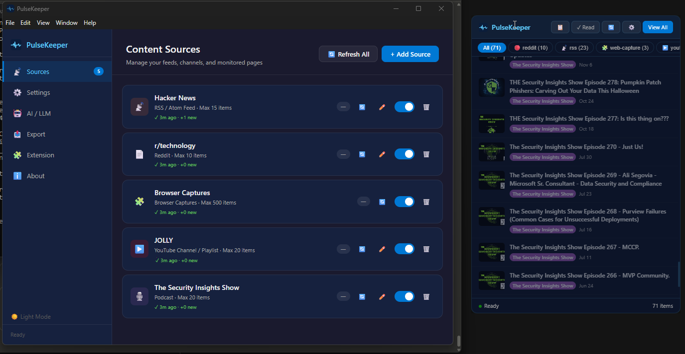
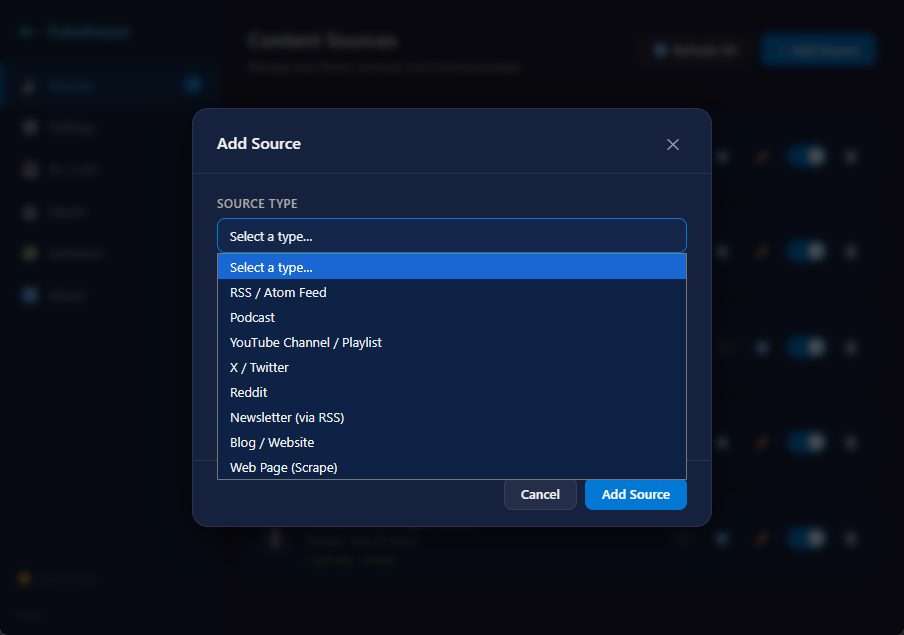
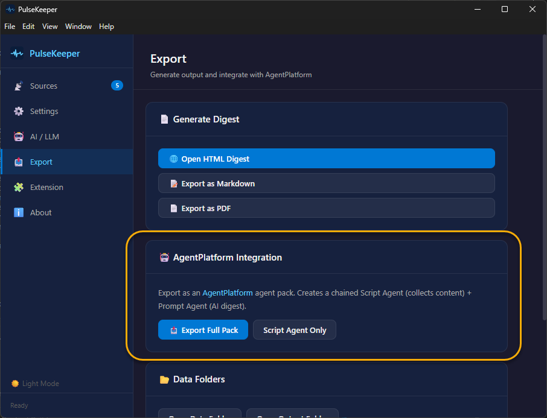
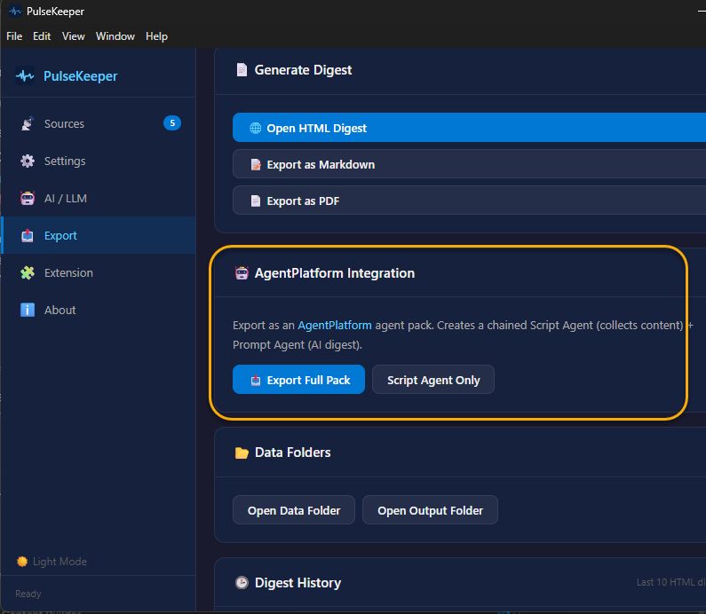

# PulseKeeper

**Keep your pulse on the content that matters.**

PulseKeeper is a Windows 11 system tray app built with Electron and Node.js. It aggregates content from RSS feeds, YouTube channels, Reddit, podcasts, newsletters, blogs, and web pages, then delivers it as a clean digest in HTML, Markdown, or PDF. It also integrates directly with [AgentPlatform](https://github.com/rod-trent/AgentPlatform) for AI-powered summarization.

---

## Screenshots









---

## Features

- **System tray app** — lives quietly in the Windows 11 tray; left-click opens the content popup, right-click shows the menu
- **Multiple source types** — RSS, YouTube, Reddit, Podcasts, Newsletters, Blogs, Web Pages, and Browser Captures
- **No API keys required** — every source type works without a developer account or credentials
- **Unread badge** — tray icon shows a red dot with count when new content arrives
- **Read tracking** — click any item to mark it read; "Mark All Read" button in the popup
- **Source health monitoring** — each source card shows last fetch time and any errors
- **RSS auto-discovery** — paste any website URL and PulseKeeper will find the feed
- **Mute words** — filter out items containing specific words across all sources
- **Per-source refresh intervals** — override the global schedule for individual sources
- **Digest history** — last 10 generated digests saved and accessible from the Export tab
- **Backup & restore** — export/import all sources and settings as a JSON file
- **Light / dark theme** — toggle in the settings sidebar
- **CSS selector scraping** — target specific sections of any web page with optional change monitoring
- **Browser extension** — Chrome/Edge Manifest V3 extension to capture pages, selections, and links directly to PulseKeeper; extension files automatically copied to your data folder on startup
- **Clipboard export** — copy visible items as formatted Markdown with one click
- **AI digest generation** — connects to Anthropic, OpenAI, xAI (Grok), Ollama, or any OpenAI-compatible endpoint
- **AgentPlatform export** — export a ready-to-import agent pack JSON for use with [AgentPlatform](https://github.com/rod-trent/AgentPlatform)
- **Output formats** — generate digests as styled HTML, Markdown, or PDF
- **Fluent Design UI** — dark navy/cyan Windows 11 aesthetic throughout
- **Auto-refresh** — configurable cron schedule keeps sources up to date in the background

---

## Requirements

- Windows 10 / 11
- [Node.js](https://nodejs.org/) 18 or later
- npm 9 or later

---

## Getting Started

```bash
# Clone the repo
git clone https://github.com/rod-trent/PulseKeeper.git
cd PulseKeeper

# Install dependencies
npm install

# Generate browser extension icons (run once)
node extension/generate-icons.js

# Launch the app
npm start
```

The app will appear in your system tray. Left-click the icon to open the content popup; right-click for the menu.

---

## Building a Distributable

```bash
npm run build
```

This produces a Windows NSIS installer in the `dist/` folder via [electron-builder](https://www.electron.build/).

---

## Source Types

| Type | What you provide | API key? |
|---|---|---|
| **RSS / Atom** | Feed URL | No |
| **Podcast** | Podcast RSS feed URL | No |
| **YouTube** | Channel URL (`/channel/UCxxxxxx` recommended) or `@handle` | No |
| **Reddit** | Subreddit name + sort (hot / new / top / rising) | No |
| **Newsletter** | Feed URL (Substack, Beehiiv, Ghost, etc.) | No |
| **Blog** | Feed URL | No |
| **Web Page** | URL + optional CSS selectors for title, link, and content | No |
| **Web Capture** | Managed by the browser extension — no manual config needed | No |

### Notes on specific sources

**YouTube** — The most reliable URL format is `https://www.youtube.com/channel/UCxxxxxx`. Find your channel ID in YouTube Studio → Settings → Channel → Basic Info. `@handle` URLs are also resolved automatically using YouTube's innertube API.

**Podcast** — Paste the show's public RSS feed URL. No Spotify account or developer credentials needed. To find a podcast's RSS URL: check the show's website, search on [podchaser.com](https://podchaser.com), or use [Listen Notes](https://listennotes.com).

**Reddit** — Uses the public RSS feed for each subreddit. No Reddit account or API key required.

---

## Browser Extension

The browser extension is automatically copied to your PulseKeeper data folder on startup:

```
%USERPROFILE%\Documents\PulseKeeper\extension\
```

### Install

1. In PulseKeeper settings, go to the **Extension** tab and click **Open Extension Folder** to open the folder above.
2. Open **chrome://extensions** (Chrome) or **edge://extensions** (Edge)
3. Enable **Developer mode**
4. Click **Load unpacked** and select the folder that opened

### Usage

- Right-click any page → **Send page to PulseKeeper**
- Right-click a selection → **Send selection to PulseKeeper**
- Right-click a link → **Send link to PulseKeeper**
- Click the PulseKeeper toolbar icon to open the extension popup

The extension communicates with the desktop app via a local HTTP server on **port 7828**. The Extension tab in settings shows a live **Capture Server Status** indicator. PulseKeeper must be running for captures to work.

---

## Popup Features

The tray popup provides a quick view of your latest content:

- **Filter chips** — filter by source type (RSS, YouTube, Reddit, etc.)
- **Unread badge** — tray icon count resets when you open the popup
- **Mark as read** — click any item to open it and mark it read (fades to 50% opacity)
- **Mark All Read** — ✓ Read button marks everything currently visible
- **Copy to clipboard** — 📋 button copies all visible items as formatted Markdown
- **Refresh** — 🔄 button triggers an immediate fetch of all sources
- **View All** — opens the full HTML digest in your browser

---

## Settings

### General
- Global refresh interval (minutes)
- Collect on startup toggle
- Max items per source default

### Source Health
Each source card in the **Content Sources** tab shows:
- Last successful fetch time
- Error message if the last fetch failed
- Per-source refresh interval override

### Mute Words
Enter words or phrases (one per line) in the **Mute Words** field under Settings. Any content item whose title or description contains a muted word is silently dropped across all sources.

### Theme
Click the theme toggle button (☀️ / 🌙) in the settings sidebar to switch between dark (default) and light mode.

### Backup & Restore
Under **Settings → Backup & Restore**:
- **Export Backup** — saves all sources, settings, and configuration as a single JSON file
- **Import Backup** — restores from a previously exported backup

---

## Digest History

Every time you generate a digest, it is automatically saved to:

```
%USERPROFILE%\Documents\PulseKeeper\history\
```

The last 10 digests are listed in the **Export** tab with an **Open** button for each. The `historyMaxCount` setting controls how many are kept.

---

## AgentPlatform Integration

PulseKeeper can export an agent pack that runs inside [AgentPlatform](https://github.com/rod-trent/AgentPlatform).

### Export

In the **Export** tab, click **Export Agent Pack**. This produces a JSON file with two chained agents:

1. **Content Collector** — runs `scripts/pk-bridge.js` to read the latest cached content from all enabled sources and output it as Markdown
2. **AI Digest** — feeds that Markdown into your configured LLM and produces a summarized digest

Import the JSON into AgentPlatform and it will run on the same refresh schedule configured in PulseKeeper.

### pk-bridge.js (standalone)

`scripts/pk-bridge.js` can also be used directly from the command line:

```bash
node scripts/pk-bridge.js --format markdown --max 40
```

| Flag | Values | Default |
|---|---|---|
| `--format` | `text`, `markdown`, `json` | `text` |
| `--max` | number | `30` |

---

## AI / LLM Configuration

Open the **AI / LLM** tab in settings. Supported providers:

| Provider | Notes |
|---|---|
| **Anthropic** | Claude models — requires API key |
| **OpenAI** | GPT models — requires API key |
| **xAI** | Grok models — requires API key |
| **Ollama** | Local models, no API key — set base URL to `http://localhost:11434/v1` |
| **Custom** | Any OpenAI-compatible endpoint |

---

## Data Storage

All data is stored locally — nothing is sent to any cloud service except your configured LLM provider when generating a digest.

```
%USERPROFILE%\Documents\PulseKeeper\
├── sources.json          # Source definitions
├── settings.json         # App settings
├── read.json             # Read item IDs
├── health.json           # Per-source fetch health
├── content\
│   └── <sourceId>.json   # Cached items per source
├── output\
│   ├── digest.html
│   ├── digest.md
│   └── digest.pdf
├── history\              # Last 10 generated digests
│   └── digest-YYYY-MM-DD_HH-MM.<ext>
└── extension\            # Browser extension (auto-copied on startup)
    ├── manifest.json
    ├── background.js
    └── ...
```

---

## Project Structure

```
PulseKeeper/
├── src/
│   ├── main/
│   │   ├── index.js          # Main process, tray, IPC, badge
│   │   ├── preload.js        # contextBridge API
│   │   ├── storage.js        # File-based persistence
│   │   ├── collector.js      # Source fetch orchestration, mute words
│   │   ├── scheduler.js      # node-cron refresh
│   │   ├── server.js         # Local HTTP capture server (port 7828)
│   │   ├── outputRenderer.js # HTML / Markdown / PDF generation
│   │   ├── llmClient.js      # Universal LLM client
│   │   ├── agentExport.js    # AgentPlatform pack builder
│   │   └── sources/
│   │       ├── index.js      # Source type registry & dispatcher
│   │       ├── rss.js        # RSS / Atom / Podcast feeds
│   │       ├── youtube.js    # YouTube (innertube API + RSS)
│   │       ├── twitter.js    # X / Twitter API v2
│   │       ├── reddit.js     # Reddit RSS feed
│   │       ├── webpage.js    # Web page scraping (Cheerio)
│   │       └── rssDiscover.js # RSS auto-discovery
│   └── renderer/
│       ├── index.html        # Settings window
│       ├── popup.html        # Tray popup
│       ├── app.js            # Settings window logic
│       ├── popup.js          # Popup logic
│       └── styles.css        # Fluent Design theme (dark + light)
├── extension/                # Chrome/Edge MV3 extension (source)
│   ├── manifest.json
│   ├── background.js
│   ├── content.js
│   ├── popup.html/css/js
│   ├── generate-icons.js
│   └── icons/
├── scripts/
│   └── pk-bridge.js          # AgentPlatform bridge / CLI
├── assets/
│   └── icon.svg
└── package.json
```

---

## License

MIT — see [LICENSE](LICENSE)

---

*PulseKeeper is a companion app to [AgentPlatform](https://github.com/rod-trent/AgentPlatform).*
