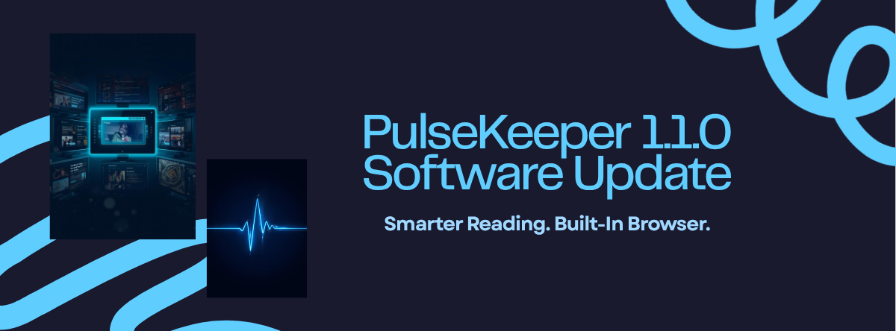

# PulseKeeper v1.1.0: A Bigger, Smarter Content Hub



When I shipped PulseKeeper v1.0.0 earlier this month, the core idea was solid: a quiet Windows 11 tray app that aggregates your content sources and gets out of the way. RSS feeds, YouTube channels, Reddit, podcasts, newsletters, web pages — all in one place, no API keys, no subscriptions, no nonsense.

But there was a list of things it didn't do yet. And that list got a lot shorter today.

**PulseKeeper v1.1.0** is a substantial update. Eighteen new features across the digest viewer, the content popup, the settings panel, and the source management experience. The short version: the in-app digest is now a real browser with real navigation, your sources now tell you how many items you haven't read yet, and PulseKeeper can now generate your digest for you on a schedule without you lifting a finger.

Here's everything that's new.

---

## A Real Browser Inside the Digest

The HTML digest viewer was always the most polished part of PulseKeeper — a clean, filterable reading view generated from everything your sources pulled in. The one thing it was missing was the ability to actually *browse* from within it. Click an article link and you'd be handed off to your system browser. Fine, but not ideal.

That changes in v1.1.0.

### Navigation Toolbar

The digest now has a full navigation toolbar at the top: **Back**, **Forward**, **Reload**, **Home**, a **URL bar** showing where you are, and an **Open External** button to hand the current page off to your system browser any time you want.

The toolbar is always present — not just on the digest itself, but on every article page you navigate to from it. When you click an article and the viewer loads that external page, the toolbar is automatically injected into the top of that page so you never lose your navigation controls, regardless of whose site you're reading.

There's also a **✕ Digest** button that appears whenever you've navigated away from the digest home. One click and you're back.

### Choose Your Browser

A new setting — **Open Digest Articles In** — lets you decide how article links behave:

- **In-app browser** — links open inside the PulseKeeper digest viewer, with full navigation
- **External browser** — links open in your system default browser, the v1.0.0 behavior

Both modes respect your choice consistently. If you want to stay in one reading environment, you can. If you prefer everything to open in Chrome or Edge, that works too.

---

## Unread Counts, Everywhere

In v1.0.0, the tray icon showed a red badge with a total unread count. That was useful, but once you opened the popup or the digest, you lost that signal — everything looked the same whether you'd read it or not.

v1.1.0 brings unread awareness all the way through the reading experience.

### Popup Filter Chips

The filter chips in the tray popup — the row of buttons across the top that let you filter by source type — now show live unread counts as red badges on each chip. At a glance, you can see "5 unread RSS items" versus "2 unread YouTube items" without opening anything.

The badges update in real time as you read. Mark something as read, and the count on its chip drops immediately.

### Digest Viewer Sidebar

The sidebar in the HTML digest previously showed total item counts per source type. It now shows **unread counts** — how many items from that source type you haven't read yet. Items you've already read are also visually dimmed in the main content area so it's easy to see what's new and what you've already been through.

The digest header also shows a running total: "14 unread · 3 new since last digest."

---

## "New Since Last Digest" Diff

Every time you open the digest, PulseKeeper now compares the current item set against the previous saved digest and badges any item that wasn't there last time with a green **New** label.

This is particularly useful if you generate digests frequently. Instead of re-reading content you've already seen, you can immediately spot what's come in since your last review. The digest header shows the count too — "3 new since last digest" — so you know at a glance whether it's worth a full read or just a quick scan.

---

## Search — In the Digest and in the Popup

Both the digest viewer and the tray popup now have a full-text search bar.

Type anything and the item list filters instantly — matching against both titles and descriptions. It works in combination with the type filter chips, so you can search for "AI" within only your RSS feeds, or look for a specific video title within your YouTube items. No server calls, no indexing, just fast client-side filtering.

---

## Mark All Read: Undo Toast

Previously, clicking **Mark All Read** in the popup was immediate and irreversible. One misclick and everything was gone.

v1.1.0 replaces that with a 4-second undo window. A toast appears at the bottom of the popup: "Marking 47 items as read…" with an Undo button. Click Undo within 4 seconds and nothing is marked. Let it expire and the action commits. Simple, but the kind of thing that saves you from yourself when you click too fast.

---

## Auto Digest — Generate on a Schedule

This is the feature I've been most excited about.

PulseKeeper can now generate your digest automatically every day at a time you choose, without you having to open the app and click a button. Enable **Auto Digest** in Settings, set a time — say, 7:00 AM — and every morning PulseKeeper generates a fresh HTML digest from everything your sources collected overnight, saves it to history, and sends you a Windows notification.

Click the notification and the digest opens immediately.

This pairs with the [AgentPlatform](https://github.com/rod-trent/AgentPlatform) integration in a nice way: PulseKeeper can handle collection and local digest generation automatically, while AgentPlatform handles the AI summarization and delivery pipeline on its own schedule.

---

## Keep Records For (1–5 Days)

PulseKeeper previously kept items in cache indefinitely, bounded only by the max-items-per-source limit. Over time, that means stale content piling up alongside fresh content.

v1.1.0 adds a **Keep Records For** setting — 1 to 5 days. Items older than the selected window are automatically pruned on each refresh cycle. Set it to 1 day if you want to keep things tight and only see what's recent. Set it to 5 days if you read infrequently and want a full week's worth of content available.

---

## Source Health Dashboard

The source list already showed a small health indicator on each source card — a timestamp and an error if the last fetch failed. In v1.1.0 there's now a dedicated **Health** tab in the main window.

Every source gets a full metrics view:

- **Last Fetch** — how long ago the source was last successfully collected
- **New Items** — how many new items came in on that last fetch
- **Cached** — total items currently in cache for that source
- **Status** — OK or Error, with the full error message shown in red if something went wrong

It's a quick way to audit your source list and spot anything that's been silently failing.

---

## Import OPML

If you have a feed reader subscription list — or you're migrating from another app — you can now bulk-import RSS feeds from any OPML file directly into PulseKeeper.

Click the new **Import OPML** button in the Sources tab header, select your `.opml` or `.xml` file, and PulseKeeper parses it and creates RSS sources for every feed it finds. No manual copy-pasting of URLs.

OPML export is a standard feature of most feed readers (Feedly, NewsBlur, Inoreader, NetNewsWire, etc.), so if you have a reading list in any of those, you can bring it straight into PulseKeeper.

---

## Per-Source Mute Word Bypass

Global mute words let you filter out content containing specific terms across all your sources. That's useful — except when you follow a source specifically *because* it covers a topic you've otherwise muted.

Each source now has a **Bypass Global Mute Words** toggle in the edit modal. Enable it on a source and items from that source will always appear, regardless of what words you've muted globally. The source card in your list gets an **Unmuted** badge so it's clear which sources are opted out.

---

## YouTube Playlist Badge

YouTube sources now show a **Playlist** badge on their source card when the configured URL points to a playlist rather than a channel. Previously, playlists and channels looked identical in the list. The badge makes it easy to tell them apart at a glance.

---

## Digest Font Size

A new **Digest Font Size** preference in Settings — Small, Medium, or Large — scales the base font size across the entire HTML digest. Useful on high-DPI displays where Medium feels too small, or if you prefer a more compact reading view.

---

## Configurable History Count

The digest history was previously fixed at 10 entries. v1.1.0 exposes this as a setting in the Export tab: choose to keep 5, 10, 20, 30, or 50 digests in the archive. The pruning happens automatically — PulseKeeper keeps the newest N and removes the rest.

---

## Notification Click-Through

Windows toast notifications now actually do something when you click them.

- Clicking a **refresh notification** opens the tray popup
- Clicking a **daily digest notification** opens the digest viewer

Previously clicking them did nothing. Now they take you directly to the relevant content.

---

## Keyboard Shortcuts

The main settings window now has keyboard shortcuts for the most common actions:

| Shortcut | Action |
|---|---|
| `Ctrl+R` | Refresh all sources |
| `Ctrl+E` | Open digest |
| `Ctrl+,` | Jump to Settings tab |
| `Ctrl+N` | Add new source |

These work anywhere in the main window that isn't a text field.

---

## Automatic Windows Theme Sync

PulseKeeper now follows the Windows system dark/light mode setting automatically.

If you switch Windows to light mode, PulseKeeper switches with it. If you switch back to dark, same thing. No manual toggle required.

If you *do* manually toggle the theme inside PulseKeeper, your preference is pinned — PulseKeeper notes that you've made an explicit choice and stops following the OS. To re-enable auto-sync, toggle once more (or change the system theme with the auto-follow behavior not having been manually overridden).

---

## Getting v1.1.0

The v1.1.0 build is available now on GitHub:

**[⬇ Download PulseKeeper v1.1.0](https://github.com/rod-trent/PulseKeeper/releases/tag/v1.1.0)**

Two installer options:

- **PulseKeeper-Setup-1.1.0.exe** — full NSIS installer with Start Menu and desktop shortcuts
- **PulseKeeper-Portable-1.1.0.exe** — single-file portable, no install needed, just run it

No Node.js required. The Electron runtime and all dependencies are bundled.

If you're running v1.0.0, closing it and running the new installer over the top is all you need to do. Your sources, settings, and history carry over automatically — everything is stored in `Documents\PulseKeeper\` and the installer doesn't touch it.

To run from source:

```bash
git clone https://github.com/rod-trent/PulseKeeper.git
cd PulseKeeper
npm install
npm start
```

---

## What Hasn't Changed

Everything from v1.0.0 still works exactly as before. All eight source types (RSS, YouTube, Reddit, Podcasts, Newsletters, Blogs, Web Pages, Browser Captures) require no API keys or developer credentials. The AgentPlatform export, AI digest generation, browser extension, and backup/restore all work as described in the original announcement.

v1.1.0 adds to the foundation — it doesn't move anything.

---

## What's Next

There's more on the list. Analytics views, additional source types, and richer AgentPlatform integration are all in consideration. If something's missing that you'd find genuinely useful, open an issue on GitHub and make the case.

In the meantime, go keep your pulse on the content that matters — and now, let PulseKeeper keep it for you automatically.

---

*PulseKeeper is free and open source under the MIT license. Source code: [github.com/rod-trent/PulseKeeper](https://github.com/rod-trent/PulseKeeper)*

*It works alongside [AgentPlatform](https://github.com/rod-trent/AgentPlatform) for AI-powered digest generation and scheduling.*
